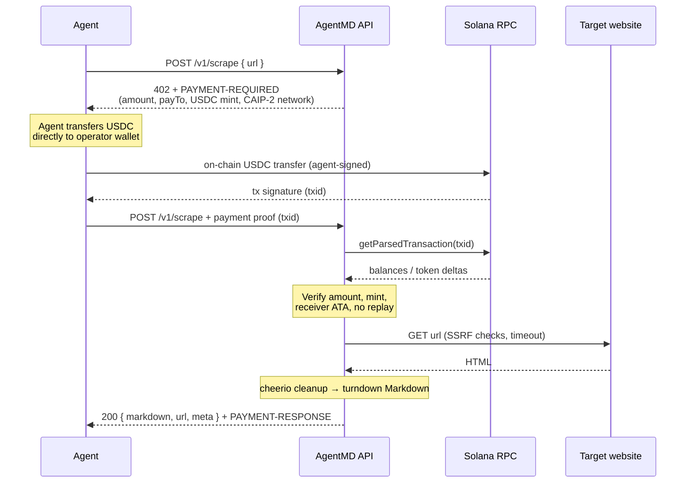

# AgentMD — Agentic Web-to-Markdown API (HTTP 402 / x402 on Solana)

**One-line pitch:** AI agents pay ~$0.01 USDC straight to **your** Solana wallet, then your tiny API turns a web page into clean Markdown. You never hold their money.

**Pack folder:** this directory (`agentic-web-to-md-pack/`).

| Item | Choice |
| --- | --- |
| Brand (recommended) | **AgentMD** (alternates: UrlInk, ClairFetch) |
| Deploy target | **Render free Web Service** + **Hono on Node** |
| Payment design | **x402 V2-shaped** challenge headers/fields, verified against official Solana/x402 docs; **settlement = direct-to-wallet then prove txid** (zero custody). Not a full facilitator settle integration. |

> **Not legal advice.** Architecture notes about “no custody / not a money transmitter” are informal risk framing for a technical founder. Confirm with a qualified lawyer in your jurisdiction before charging real users.

---

## A. Executive summary (ELI12)

**What it is.**  
AgentMD is a small website (an API) that takes a link like `https://example.com`, downloads the page, removes junk (menus, ads, scripts), and gives back neat **Markdown** text that AI agents love.

**Why build it.**  
Agents need page content constantly. Big tools (Firecrawl, Exa, Tavily) are great but usually want credit cards, monthly plans, and API keys. Agents with a crypto wallet can pay **per call** with no signup.

**Why agents pay you.**  
When an agent calls AgentMD without paying, the API answers **HTTP 402 Payment Required** (“you must pay”). The answer includes: how much USDC, which Solana address (yours), and which network. The agent sends USDC **directly to your wallet** on Solana, then calls again with the payment proof (transaction ID). Only then does AgentMD scrape and return Markdown.

**Your job day-to-day.**  
Almost none: no invoices, no customer balances, no payout dashboards. Money lands in Phantom/Backpack. The server only **checks** the blockchain; it never holds funds.

---

## B. Strategic analysis

### Competitive landscape (indicative, mid/late 2026 public pricing)

| Product | Model | Rough unit economics | Fit |
| --- | --- | --- | --- |
| **Firecrawl** | Credits; scrape often 1 credit/page | Free ~1k credits/mo; paid plans from hobby upward; effective per-page often near low-$ cents depending on plan | Best-in-class crawl/scrape suite |
| **Exa** | Per endpoint | Search ~$7/1k; Contents ~$1/1k pages | Search-first, then contents |
| **Tavily** | Credits | ~$0.005–$0.008 per basic search credit on common tiers | Agent search + extract |
| **AgentMD** | Pay-per-call USDC via 402 | Target **$0.005–$0.01** / scrape | Minimal Markdown pipe for wallet-native agents |

Sources consulted for ballpark figures: Firecrawl pricing page, Exa/Tavily comparison write-ups (Tavily blog, Garden Research, Keiro Labs). **Re-check live pricing before investor decks** — vendors change plans often.

### Why 402 micro-pay beats card SaaS for bots

1. **No human onboarding** — agents cannot easily pass KYC or punch Visa into Stripe.
2. **No API-key debt collection** — each call is prepaid on-chain.
3. **No custody ledger for you** — payment is a normal USDC transfer to your pubkey.
4. **Price can be tiny** — $0.01 is awkward on cards (fees); fine on Solana.
5. **Discovery** — x402-style directories (OrbitX402, Agora402, x402 List) index 402 APIs for agents.

### Pricing recommendation

- **Launch:** `$0.01` USDC / call (simple mental model: “one USDC cent”).
- **Entry / growth:** `$0.005` if you want denser agent traffic and still cover RPC + host opportunity cost.
- Stay in **$0.005–$0.01** until you add JS-rendering or anti-bot proxies (those raise cost).

### Moat (honest, small, real)

| Moat piece | Why it matters |
| --- | --- |
| Latency | Single-page cheerio path is fast vs heavy browser farms |
| Clean Markdown | Agents waste tokens on nav chrome; stripping is the product |
| MCP + x402 discovery | Being findable in agent registries beats a prettier landing page |
| Zero-ops | Banking-founder-friendly: no support desk for “reset my API key” |

You will **not** out-crawl Firecrawl on day one. You win on **wallet-native micropay + dead-simple Markdown**.

### SWOT

| | Helpful | Harmful |
| --- | --- | --- |
| **Internal** | **S:** Zero custody, tiny codebase, clear niche, free host | **W:** No JS-render, weak vs bot walls, single-region free tier spin-down |
| **External** | **O:** Agent economy + x402 directories + Solana USDC UX | **T:** Spec churn (x402 V1→V2), RPC rate limits, ToS/scraping disputes, copycats |

### PESTEL (short) + zero-custody framing

| Factor | Note |
| --- | --- |
| **P**olitical | Crypto rules differ by country; keep the product clearly **software**, not “payments business.” |
| **E**conomic | Micropay demand rises with agent autonomy; USDC price stability helps quoting. |
| **S**ocial | Devs expect Markdown; agents expect machine-readable 402 challenges. |
| **T**echnological | x402 V2 headers + CAIP-2 Solana IDs are now documented on solana.com; still evolving. |
| **E**nvironmental | Solana energy profile is a marketing footnote only — optional. |
| **L**egal | **Informal only:** architecture pays straight to your personal wallet; server does not take possession, pool, or re-route user funds. That is *designed* to sit closer to “sell software / data processing, customer pays you directly” than “operate a money transmission service.” **This is not a legal determination.** Scraping + copyright + computer-misuse laws still apply to *how* callers use the tool. |

**Disclaimer (read twice):** Nothing in this pack is legal, tax, or compliance advice. If you charge real money, talk to a lawyer about money-transmission, VASP, consumer, and copyright risk in **your** country. Prefer a French/EU **objet social** limited to technical software (section C).

---

## C. Branding

### Three ultra-short agent-friendly names

1. **AgentMD** ← recommended (agent-native Markdown API; short, tool-list friendly)
2. **UrlInk** (URL → ink/text)
3. **ClairFetch** (clair = clear; “clear fetch” of page text)

Repo/npm name in this pack: `agentmd-api` (suggested GitHub repo: `agentmd-api`).

### Recommended “objet social” / corporate purpose (French-style wording)

Use language that stays in **technical software**, not banking:

> **Objet social (FR):** Conception, développement, édition et exploitation de logiciels et d’interfaces de programmation (API) destinés au traitement automatisé de données provenant de sources web publiquement accessibles, notamment la conversion de contenus HTML en formats textuels structurés (tels que Markdown), ainsi que toutes opérations techniques connexes de maintenance, d’hébergement et de documentation.  
> **Exclusion expresse :** toute activité de services bancaires, de paiement pour compte de tiers, de conservation de fonds (custody), de change, de conseil en investissement ou de transmission de monnaie.

> **English twin:** Design, development, publishing and operation of software and APIs for automated processing of publicly accessible web data (including HTML→Markdown conversion), plus related technical hosting and documentation. **Expressly excluded:** banking services, payment services for third parties, custody of funds, exchange, investment advice, or money transmission.

---

## D. Step-by-step noob guide (Steps 1–5)

### Step 1 — Dedicated Solana wallet (Phantom or Backpack)

1. On your phone or Chrome: install **Phantom** (https://phantom.app) *or* **Backpack**.
2. Create a **new** wallet used only for this side project (do not reuse your life savings wallet).
3. Write the **seed phrase** on paper. Store offline.  
   **NEVER** share it. **NEVER** paste it into Discord, ChatGPT, Render, or this repo.
4. Open **Receive** → copy your **public address** (long base58 string). That is `RECEIVER_WALLET`. Safe to share.
5. Optional: buy a little SOL (fees) + USDC on Solana in that wallet so you can test sending to yourself later.

### Step 2 — Project folder, paste files, install

```bash
cd /path/to/agentic-web-to-md-pack
cp .env.example .env
# edit .env — put your public address in RECEIVER_WALLET
npm install
```

### Step 3 — Environment variables

Edit `.env` (see `.env.example` for every key):

| Variable | Meaning |
| --- | --- |
| `RECEIVER_WALLET` | Your public Solana address |
| `PRICE_USDC` | `0.01` or `0.005` |
| `SOLANA_NETWORK` | `mainnet-beta` or `devnet` |
| `SOLANA_RPC_URL` | RPC endpoint |
| `USDC_MINT` | Circle USDC mint (mainnet default provided) |
| `TEST_MODE` | `true` only on localhost |
| `PUBLIC_BASE_URL` | Your https URL after deploy |
| `PORT` | Local port (default `8787`) |

### Step 4 — Deploy FREE on Render (recommended)

**Why Render + Hono/Node:** fewest moving parts for a beginner; Solana libraries run normally; free Web Service is enough for a side project. Cloudflare Workers is a later upgrade (edge). Vercel is a possible alternate but weaker for long scrapes + Solana RPC.

**Exact clicks:** follow **[DEPLOY.md](./DEPLOY.md)** (GitHub → Render New Web Service → env vars → Create).

### Step 5 — Test with curl / script

Local (skip chain pay):

```bash
# Terminal A
TEST_MODE=true RECEIVER_WALLET=YourPubkeyHere npm run dev

# Terminal B
curl -si -X POST http://localhost:8787/v1/scrape \
  -H 'Content-Type: application/json' \
  -d '{"url":"https://example.com"}'
# → HTTP 402

AGENTMD_BASE_URL=http://localhost:8787 npm run test:client
# → detects TEST_MODE, sends mock proof, prints Markdown
```

Production unpaid probe:

```bash
curl -si -X POST https://YOUR-APP.onrender.com/v1/scrape \
  -H 'Content-Type: application/json' \
  -d '{"url":"https://example.com"}'
```

Paid retry (after you actually sent USDC):

```bash
curl -si -X POST https://YOUR-APP.onrender.com/v1/scrape \
  -H 'Content-Type: application/json' \
  -H 'X-Payment-Tx: YOUR_SOLANA_TX_SIGNATURE' \
  -d '{"url":"https://example.com","paymentTxSignature":"YOUR_SOLANA_TX_SIGNATURE"}'
```

---

## E. Technical architecture



---

## x402 verification status (important)

**Verified against real docs (research pass for this pack):**

- Solana guide: https://solana.com/docs/payments/agentic-payments/x402 (V2 headers, CAIP-2 IDs, `exact` scheme)
- HTTP transport: `PAYMENT-REQUIRED` / `PAYMENT-SIGNATURE` / `PAYMENT-RESPONSE` (base64 JSON)
- Requirement fields: `scheme`, `network`, `amount`, `asset`, `payTo`, `maxTimeoutSeconds`, `extra`
- Mainnet USDC mint: `EPjFWdd5AufqSSqeM2qN1xzybapC8G4wEGGkZwyTDt1v`

**Designed as 402-inspired / V2-shaped on settlement:**

- Official happy path often uses a **facilitator** to verify + settle a signed payload.
- AgentMD uses **direct USDC transfer → prove with tx signature** so the operator **never** creates, custodians, or routes funds.
- `extra.settlementMode = "direct-transfer-then-prove"` advertises that clearly.

**Double-check before calling yourself “fully x402 compatible”:** live `PaymentPayload` Solana exact fields (`transaction` vs serialized tx), facilitator `/verify`/`/settle` expectations, and whether registries require `/.well-known/x402` shapes beyond what we ship. See **[x402-registration.md](./x402-registration.md)**.

---

## Project files

```
agentic-web-to-md-pack/
├── README.md                 ← you are here
├── DEPLOY.md                 ← Render click-by-click
├── x402-registration.md      ← OrbitX402 / Agora402 / checklist
├── package.json
├── tsconfig.json
├── .env.example
├── openapi.yaml
├── mcp/manifest.json
├── scripts/client-test.ts
└── src/
    ├── server.ts             ← Hono API
    ├── verify-payment.ts     ← Solana verify only (no custody)
    └── scrape.ts             ← SSRF-safe fetch + Markdown
```

### Local commands

```bash
npm install
cp .env.example .env   # then edit
npm run dev            # http://localhost:8787
npm run build && npm start
npm run test:client
```

### MCP note (honest)

MCP classically = local **stdio** JSON-RPC server. AgentMD is a **remote HTTP** tool. `mcp/manifest.json` describes the HTTP tool + payment metadata for indexers. If your agent host only loads stdio MCP, wrap AgentMD with a 30-line proxy that calls `POST /v1/scrape` (do not put the operator seed in the wrapper; agents pay from **their** wallet).

### Safety features included

- Block localhost / private IPs / link-local (SSRF)
- Only `http`/`https`
- Fetch timeout + max HTML size
- Body size limit
- Replay set for used tx signatures (upgrade to Redis for multi-instance)
- Comments reminding you about robots.txt / site ToS

### Zero-custody guarantee (product rule)

- Server **never** builds user payment transactions.
- Server **never** holds, pools, or forwards USDC/SOL for users.
- Server only **reads** chain state to verify inbound transfers to `RECEIVER_WALLET`.

---

## Legal / ops caveats to surface

1. **Not legal advice** — money-transmission / VASP / tax treatment varies; get counsel.
2. **Scraping** can violate site Terms or local computer-access laws — callers are responsible for targets they request; you should still refuse abuse (SSRF, huge fan-out).
3. **TEST_MODE** must stay `false` in production.
4. Free Render **sleeps** — first request can be slow.
5. Public Solana RPC may rate-limit — plan a free Helius/QuickNode key when traffic appears.
6. In-memory replay protection resets on restart — fine for MVP; use Redis later.
7. x402 ecosystem listings may charge fees or change APIs — verify live.

---

## License / tone of API responses

Responses talk about **technical scrape results** and **payment proofs**. They do **not** give trading advice, banking services, yield, or custody claims.
